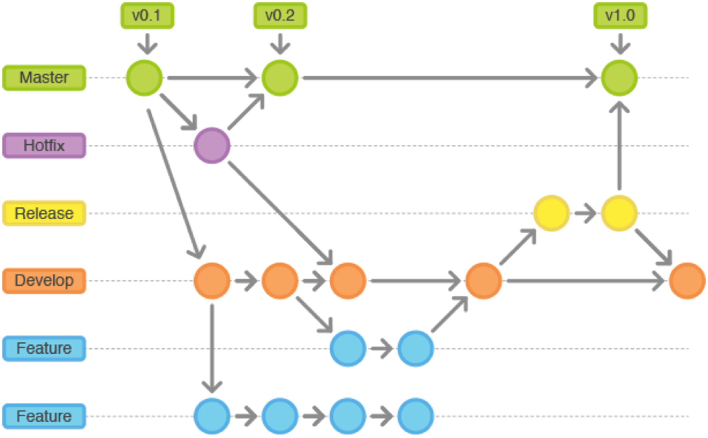
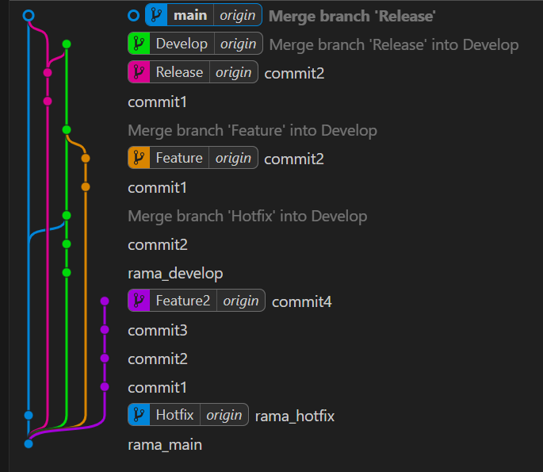

# Tarea del tema 18 de Entornos

## Uso de comandos

- No he utilizado comandos para hacer esta actividad ya que he utilizado la interfaz gráfica mediante una extensión de Visual Studio Code.

## Explicación de la realización del ejercicio
    Para realizar esta tarea he empezado creando un repositorio de una carpeta creada anteriormente, luego he empezado creando todas las ramas,
    creamos un archivo txt como si fuese un proyecto, en la siguiente imagen se muestra el esquema donde aparecen varios circulos que hacen
    referencia a los commit que tenemos que realizar, cuando a un circulo le llegan más de una flecha es un merge que es una combinación
    de una rama con otra.


### Esquema
- Este es el esquema que muestra el flujo de los commit y sus distintas ramas       
    ```markdown
    ## Esquema a seguir
   

 

 ### Resultado del ejercicio

 - Este mi esquema despues de haber seguido el esquema anterior y haber hecho el ejercicio
    ```markdown
    ## Mi esquema realizado

